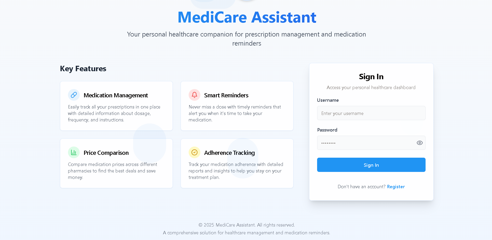
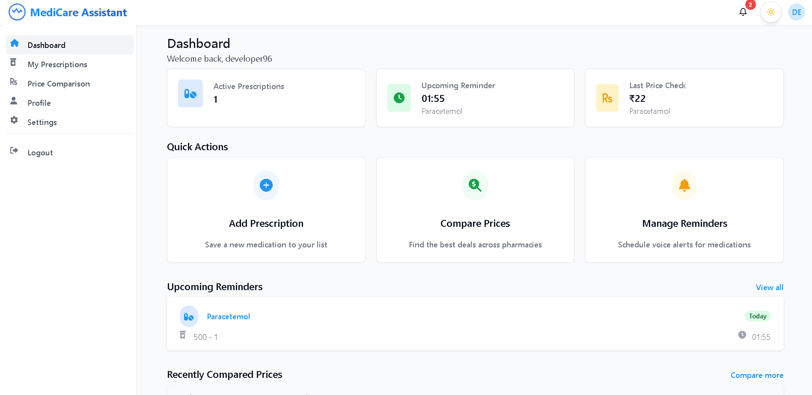
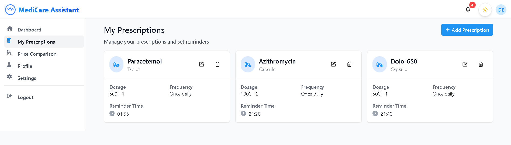
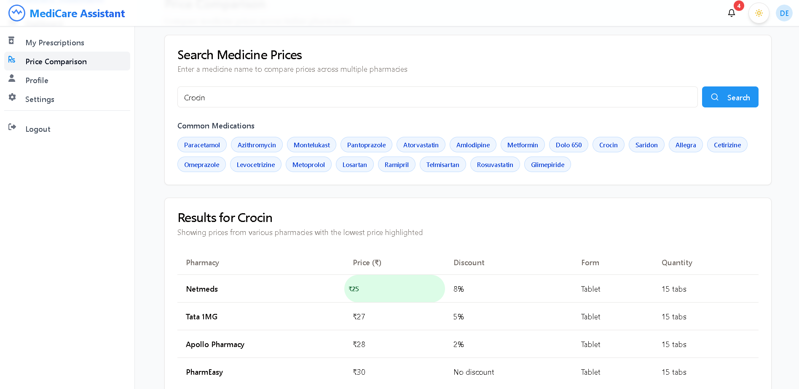

# 🏥 MediCare Assistant

A modern full-stack healthcare platform that helps patients manage prescriptions, receive voice-based medication reminders, compare medicine prices across multiple pharmacies, and stay informed through real-time notifications. The application is designed to improve medication adherence and simplify healthcare management with an intuitive and responsive user interface.

---

## ✨ Features

- 💊 Add, edit, and delete prescriptions
- ⏰ Schedule medication reminders
- 🔊 Voice-based medication alerts
- 💰 Compare medicine prices across different pharmacies
- 🔔 Real-time notification system
- 📊 Interactive dashboard with prescription overview
- 🔐 Secure user authentication and session management
- 📱 Responsive and user-friendly interface

---

## 🛠️ Tech Stack

### Frontend
- React.js
- TypeScript
- Vite
- Tailwind CSS 
- Radix UI
- HTML

### Backend
- Node.js
- Express.js

### Database
- PostgreSQL
- Drizzle ORM

### Authentication
- Passport.js
- Express Session

### Tools
- Git & GitHub
- VS Code
- Replit Agent

---

## 📸 Screenshots

### 🏠 Home Page

### 📊 Dashboard

### 💊 My Prescriptions

### 💰 Price Comparison

